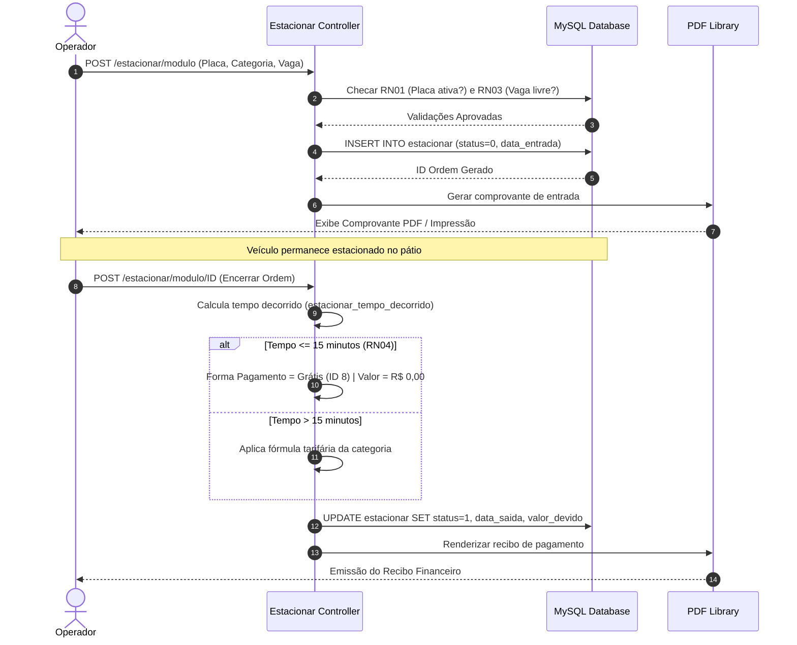
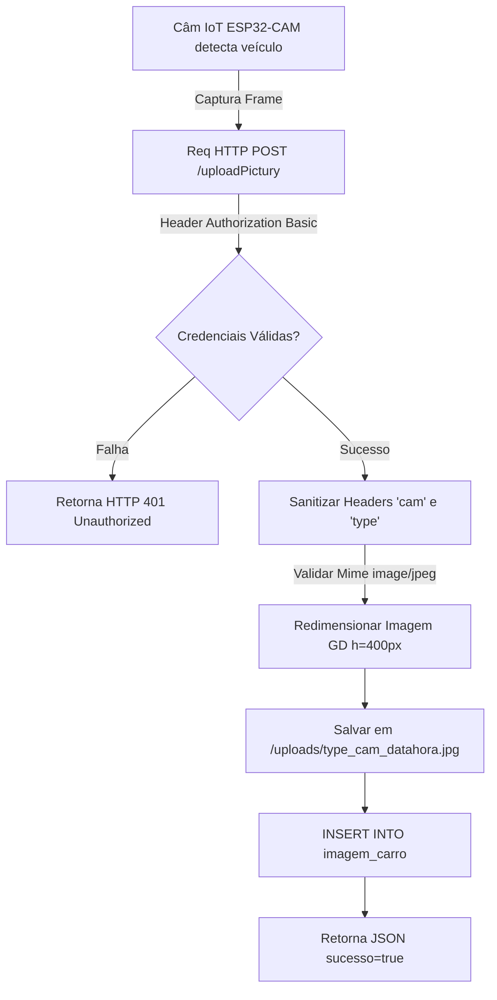
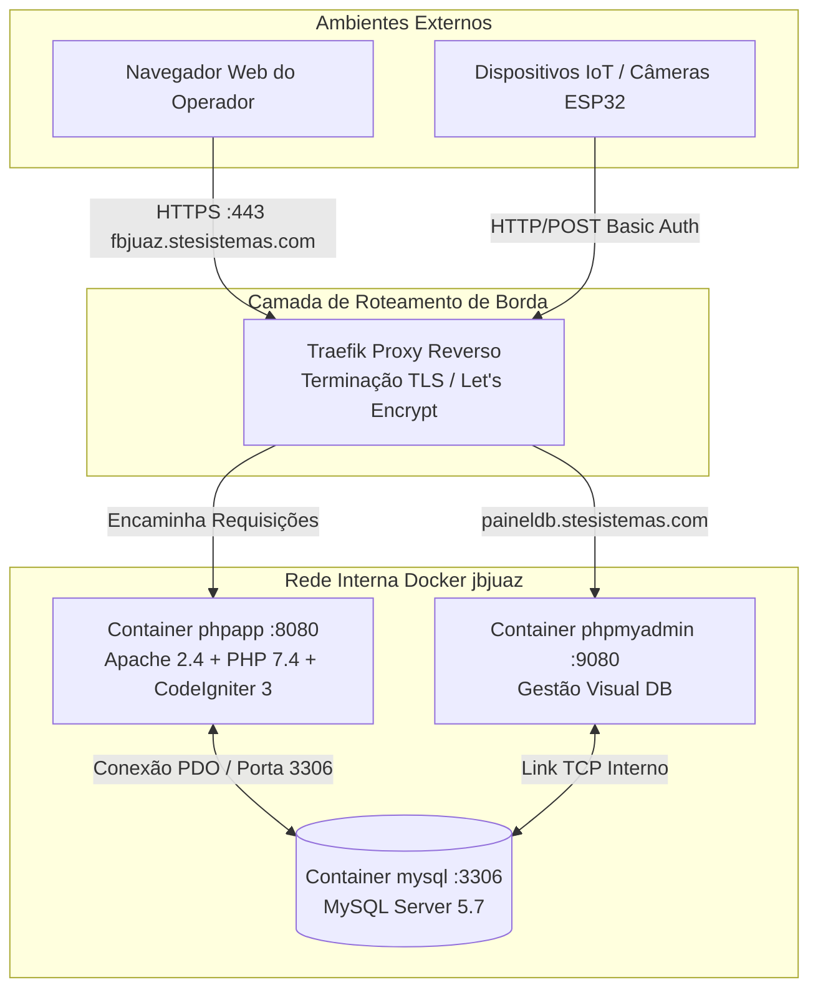
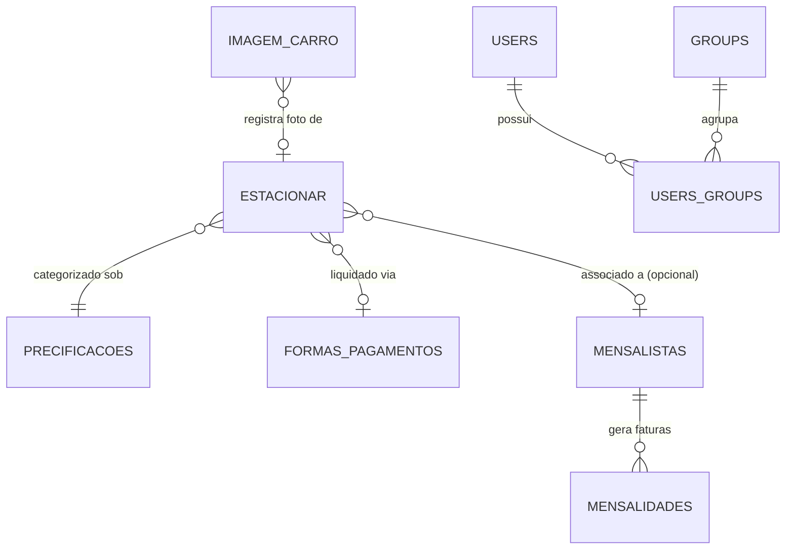

# Documentação Técnica e Arquitetural — JBEstacionamento

## 1. Visão Geral

O **JBEstacionamento** é um sistema integral de gestão de estacionamentos rotativos e mensalistas, desenvolvido para controlar de forma precisa o fluxo de entrada e saída de veículos, precificação dinâmica por categorias (carros pequenos, médios, grandes e motocicletas), faturamento de assinaturas recorrentes, emissão de comprovantes térmicos/PDF e telemetria automatizada em tempo real via hardware IoT (câmeras ESP32-CAM e sensores de contagem de vagas).

---

## 2. Stack Tecnológica

O ecossistema do projeto baseia-se em uma arquitetura clássica de aplicação web acoplada a serviços de borda e dispositivos embarcados:

* **Linguagem Backend**: PHP 7.4 executando sob servidor web Apache 2.4.
* **Framework Web**: CodeIgniter 3.x (arquitetura MVC padrão, helpers de segurança e validação de formulários).
* **Banco de Dados Relacional**: MySQL 5.7.
* **Autenticação e Autorização**: Biblioteca especializada **Ion Auth** (controle de sessões baseadas em cookies para o painel web, proteção contra força bruta em logins, e autenticação *HTTP Basic Auth* para endpoints de dispositivos embarcados).
* **Frontend**: HTML5, Vanilla CSS / Bootstrap 4, DataTables dinâmicas, jQuery Mask Plugin e FontAwesome Icons.
* **Geração de Documentos**: Biblioteca **DomPDF** para renderização e emissão de tickets de estacionamento em formato PDF.
* **Infraestrutura e Orquestração**: Docker e Docker Compose, utilizando Traefik Proxy como roteador reverso de borda com resolução automática de certificados SSL Let's Encrypt.

---

## 3. Estrutura de Diretórios

A organização física do repositório segue os padrões convencionais do CodeIgniter 3 encapsulado em containers Docker:

```text
copilot-worktree-2026-04-07T14-16-10/
├── .env / .gitignore          # Variáveis de ambiente locais e exclusões do Git
├── docker-compose.yml         # Orquestração dos serviços (MySQL, PhpMyAdmin e App PHP)
├── generate-certificate.sh    # Script auxiliar para geração de certificados SSL de desenvolvimento
├── db_data_jbjuaz/            # Diretório montado em volume persistente do MySQL
└── app_php/                   # Diretório principal da aplicação web
    ├── Dockerfile             # Receita de build da imagem php:7.4-apache com extensões PDO
    ├── composer.json          # Manifesto de dependências PHP (CodeIgniter)
    ├── index.php              # Front Controller de inicialização do framework
    ├── unzipper.php           # Utilitário autônomo de manutenção de pacotes
    ├── SQL/                   # Scripts DDL e DML para estruturação do banco de dados
    ├── uploads/               # Armazenamento físico das fotos capturadas pelas câmeras IoT
    ├── public/ / dist/        # Ativos estáticos (Folhas de estilo CSS e Scripts JS)
    └── application/           # Núcleo MVC do CodeIgniter
        ├── config/            # Configurações globais, rotas (routes.php) e parâmetros do Ion Auth
        ├── controllers/       # Controladores de rotas e regras de negócio
        ├── models/            # Camada de abstração e persistência de dados
        ├── views/             # Templates de interface do operador e relatórios
        └── libraries/         # Bibliotecas customizadas (ex.: encapsulamento DomPDF)
```

---

## 4. Módulos e Funcionalidades

O sistema divide-se em cinco grandes módulos operacionais:

1. **Módulo Operacional de Estacionamento (`Estacionar.php`)**:
   * **Entrada**: Registro de veículos com checagem de chassi/placa, associação de categoria e alocação de número de vaga.
   * **Saída**: Encerramento do ciclo operacional com cálculo exato de permanência em horas/minutos e valor financeiro devido.
   * **Isenção**: Aplicação automática do benefício de carência para estadias rápidas.
   * **Comprovantes**: Emissão de tickets formatados para bobinas térmicas de 8mm e download em PDF via DomPDF.
2. **Módulo de Mensalistas e Assinaturas (`Mensalistas.php`, `Mensalidades.php`)**:
   * Cadastro de clientes com contratos recorrentes, vinculando dados pessoais (CPF, telefone), veículo e plano contratado.
   * Controle financeiro de parcelas mensais, datas de vencimento, quitações e bloqueio de inadimplentes.
3. **Módulo de Precificações (`Precificacoes.php`)**:
   * Configuração parametrizada de tarifas de cobrança (valor por hora, valor diária, limite máximo de vagas por setor e carência).
4. **Módulo de Integração e Telemetria IoT (`UploadPictury.php`, `Apicont.php`)**:
   * **Recepção de Imagens (`POST /uploadPictury`)**: Endpoint autenticado via *Basic Auth* que recebe quadros JPEG enviados por câmeras ESP32-CAM posicionadas nas cancelas, redimensiona via extensão GD para altura padrão de 400px e registra no histórico visual.
   * **Contagem Automática (`POST /apicont`)**: Endpoint que processa payloads JSON emitidos por sensores de pátio informando contagens totais de entrada e saída, atualizando o saldo de vagas livres em tempo real.
5. **Módulo Administrativo e Gerencial (`Usuarios.php`, `Formas_pagamentos.php`, `Sistema.php`, `Galeria.php`)**:
   * Gestão de operadores do sistema, cadastro de formas de pagamento aceitas (PIX, Dinheiro, Cartão de Crédito/Débito) e parametrização dos textos de cabeçalho/rodapé dos tickets e dados fiscais da empresa (CNPJ, Razão Social).

---

## 5. Regras de Negócio

* **RN01 — Bloqueio de Placa Duplicada em Aberto**: O sistema rejeita o cadastro de entrada para qualquer veículo cuja placa já conste com uma ordem ativa (`estacionar_status = 0`).
* **RN02 — Limite Setorial de Vagas**: O operador só pode alocar um número de vaga que esteja estritamente dentro do limite configurado na tabela de precificação da respectiva categoria.
* **RN03 — Exclusividade Física de Vaga**: Uma mesma numeração de vaga não pode ser registrada simultaneamente por dois veículos com ordens em aberto na mesma categoria.
* **RN04 — Carencia Operacional (Tolerância)**: Veículos cuja permanência total entre a entrada e o encerramento seja igual ou inferior a 15 minutos recebem isenção tarifária automática (recebendo a forma de pagamento **Grátis** - ID 8).
* **RN05 — Imutabilidade de Registros Ativos**: A exclusão física de ordens de serviço no banco de dados é restrita estritamente a administradores e permitida apenas para tickets já encerrados (`estacionar_status = 1`).
* **RN06 — Blindagem de Cabeçalhos IoT**: Identificadores de câmera (`cam`) e tipo de fluxo (`type`) injetados via headers HTTP são obrigatoriamente sanitizados via expressões regulares antes de compor caminhos de sistema, prevenindo falhas de *Path Traversal*.

---

## 6. Fluxos de Operação

### Fluxo Ciclo de Vida do Veículo (Entrada, Cobrança e Saída)



### Fluxo de Telemetria Visual IoT (ESP32-CAM)



---

## 7. Arquitetura e Infraestrutura

A infraestrutura é conteinerizada sob rede isolada Docker (`jbjuaz`), utilizando o roteador reverso Traefik para terminação SSL e distribuição de carga:



---

## 8. Rotas e Endpoints

| Rota / URI | Controller / Método | Métodos HTTP | Proteção / Nível | Propósito Operacional |
| :--- | :--- | :--- | :--- | :--- |
| `/` ou `/home` | `Home::index` | GET | Ion Auth (Sessão) | Dashboard gerencial e contadores de ocupação de vagas |
| `/login` | `Login::index` | GET, POST | Acesso Público | Formulário de autenticação e validação de credenciais |
| `/login/logout` | `Login::logout` | GET | Ion Auth (Sessão) | Encerramento seguro de sessão do operador |
| `/estacionar` | `Estacionar::index` | GET | Ion Auth (Sessão) | Tabela principal de monitoramento de veículos no pátio |
| `/estacionar/modulo` | `Estacionar::modulo` | GET, POST | Ion Auth (Sessão) | Abertura de ticket de entrada de veículo |
| `/estacionar/modulo/(:num)`| `Estacionar::modulo` | GET, POST | Ion Auth (Sessão) | Encerramento de ticket, cobrança e baixa de veículo |
| `/estacionar/del/(:num)` | `Estacionar::del` | GET | Role Admin | Exclusão administrativa de registros já encerrados |
| `/estacionar/imprimir/(:num)`| `Estacionar::imprimir`| GET | Ion Auth (Sessão) | Menu de opções de reimpressão de comprovantes |
| `/estacionar/pdf/(:num)` | `Estacionar::pdf` | GET | Ion Auth (Sessão) | Emissão direta de arquivo PDF formatado via DomPDF |
| `/pagamentos` | `Formas_pagamentos::index`| GET | Ion Auth (Sessão) | Listagem e gestão de meios de pagamento aceitos |
| `/mensalistas` | `Mensalistas::index` | GET, POST | Ion Auth (Sessão) | Cadastro e manutenção de clientes recorrentes |
| `/mensalidades` | `Mensalidades::index` | GET, POST | Ion Auth (Sessão) | Lançamento de parcelas e recebimentos de mensalistas |
| `/precificacoes` | `Precificacoes::index`| GET, POST | Role Admin | Parametrização de valores por hora e diária |
| `/uploadPictury` | `UploadPictury::index`| POST, OPTIONS| Ion Auth / Basic Auth | Recepção de capturas fotográficas de placas de veículos |
| `/apicont` | `Apicont::index` | POST | Ion Auth / Basic Auth | Telemetria de contagem automatizada de pátio |

---

## 9. Banco de Dados

### Entidades e Tabelas

* **`estacionar`**: Entidade principal de movimentação. Registra `estacionar_placa_veiculo`, marca, modelo, categoria, vaga ocupada, timestamps de entrada e saída, tempo decorrido, valor devido, status transacional (`0=Aberto`, `1=Concluído`) e chave da forma de pagamento.
* **`mensalistas`**: Entidade de clientes com planos mensais ativos (nome, CPF, telefone, placa vinculada, dia de vencimento).
* **`mensalidades`**: Histórico financeiro transacional das mensalidades quitas e pendentes.
* **`precificacoes`**: Tabela de regras tarifárias por categoria de veículo.
* **`formas_pagamentos`**: Catálogo de métodos de recebimento (PIX, Dinheiro, Cartão, Grátis).
* **`imagem_carro`**: Tabela de evidências visuais contendo o caminho relativo da imagem (`dirImage`), timestamp de upload e tipo de evento (`entrada` ou `saida`).
* **`veiculos_qtd`**: Tabela de registro único (*Singleton*) contendo os somatórios globais de acessos.
* **`sistema`**: Parámetros corporativos e textos legais de emissão de tickets.
* **`users`**, **`groups`**, **`users_groups`**, **`login_attempts`**: Tabelas de controle estrutural de identidades do framework Ion Auth.

### Relacionamentos e Modelo Conceitual



---

## 10. Configurações e Variáveis de Ambiente

As configurações de ambiente e portas expostas são orquestradas via `docker-compose.yml` e arquivo `.env`:

* **`MYSQL_DATABASE`**: `estacionamentojn` (definido no serviço MySQL) e remapeado internamente pela aplicação PHP para conexão via PDO.
* **`MYSQL_USER` / `MYSQL_PASSWORD` / `MYSQL_ROOT_PASSWORD`**: Parâmetros de autenticação do container de banco de dados.
* **`PMA_HOST` / `PMA_ARBITRARY`**: Configurações de autodescoberta do painel PhpMyAdmin na porta `9080`.
* **Traefik Proxy Labels**: Configuram resolução automática de nomes (`fbjuaz.stesistemas.com` para a aplicação PHP na porta `8080`, e `paineldb.stesistemas.com` para o PhpMyAdmin), forçando redirecionamento de requisições HTTP inseguras para HTTPS sob certificado Let's Encrypt (`certresolver=le`).

---

## 11. Plano de Melhorias

Abaixo é apresentado o plano estratégico técnico priorizado para mitigação de débitos técnicos e otimização arquitetural:

| Melhoria Identificada | Descrição Clara do Problema ou Oportunidade | Impacto | Esforço Estimado | Prioridade | Ação Recomendada e Orientação Técnica Objetiva |
| :--- | :--- | :--- | :--- | :--- | :--- |
| **Proteção de Privacidade nas Fotos** | As capturas de placas em `/uploads/` estão expostas publicamente no servidor web, permitindo acesso de terceiros não autorizados caso saibam o nome do arquivo. | **Alto** | **Médio** | **P1** | Adicionar uma regra de bloqueio de leitura direta no `.htaccess` da pasta `/uploads` (`Deny from all`). Criar um método `Foto::visualizar($nome)` que exija sessão Ion Auth ativa antes de enviar os bytes via `header('Content-Type: image/jpeg')` e `readfile()`. |
| **Atualização do Motor PHP (EOL)** | O PHP 7.4 encerrou seu suporte oficial de segurança em novembro de 2022, expondo a aplicação a vulnerabilidades críticas sem correções do fabricante. | **Alto** | **Alto** | **P1** | Planejar a migração estrutural para **PHP 8.2+** acoplado ao **CodeIgniter 4** ou **Laravel 10/11**. Atualizar chamadas obsoletas (como parâmetros opcionais após obrigatórios) e revisar dependências no `composer.json`. |
| **Mitigação de Lock Contention IoT** | O endpoint `Apicont` executa *updates* síncronos na linha `id=1` da tabela `veiculos_qtd`. Sob picos de envio de múltiplas cancelas IoT, isso gera gargalo de concorrência. | **Médio** | **Médio** | **P2** | Alterar a recepção IoT para gravar eventos imutáveis em uma tabela de log (`telemetria_patios_log`). Calcular a lotação instantânea através de agregações periódicas ou utilizar cache em memória (**Redis**). |
| **Padronização de Variáveis de Banco** | Divergência de nomenclatura no `docker-compose.yml`, onde o MySQL cria o banco `estacionamentojn`, mas a aplicação espera `estacionamento_mysql`. | **Médio** | **Baixo** | **P2** | Unificar todas as referências no orquestrador e no arquivo `application/config/database.php` para utilizar estritamente a variável de ambiente padronizada `getenv('MYSQL_DATABASE')`. |
| **Declaração Formal de Foreign Keys** | O arquivo DDL do banco não declara chaves estrangeiras explícitas com restrições `ON DELETE RESTRICT` entre tabelas transacionadas, permitindo registros órfãos. | **Baixo** | **Médio** | **P3** | Elaborar um script SQL de migração (`ALTER TABLE`) adicionando restrições relacionais explícitas entre `estacionar` ↔ `precificacoes` e `estacionar` ↔ `formas_pagamentos`. |
| **Isolamento de Volumes em Produção** | O volume Docker monta a raiz inteira da aplicação local dentro do container, criando risco de sobrescrita de código em produção. | **Médio** | **Baixo** | **P3** | Refatorar o `Dockerfile` adotando *Multi-stage Build* (`composer install --no-dev`). No `docker-compose.yml` de produção, mapear volumes estritamente para as pastas `/var/www/html/uploads` e `/var/www/html/application/logs`. |

---

## 12. Considerações Finais

O projeto **JBEstacionamento** apresenta uma base operacional sólida, cobrindo integralmente as necessidades práticas de controle de pátios comerciais. O acoplamento com dispositivos embarcados ESP32 confere à solução um excelente nível de automação e telemetria de borda. 

A adoção das melhorias listadas nas prioridades **P1** e **P2** garantirá a conformidade de segurança e privacidade da informação (*LGPD*), além de preparar a plataforma para operar com alta escalabilidade e baixíssima latência nos próximos anos.
